ple.27.7d OM
================
Simon Fischer (Cefas)
2026-04-08

------------------------------------------------------------------------

## Introduction

This document creates the objects required for an operating model for
ple.27.7d. It is based on the WGNSSK 2025 SAM assessment. The approch of
generating the OM is the standard approach used in ICES MSEs,
i.e. sampling from the variance-covariance matrix from the SAM model
fit. This is the same approach as used in recent ICES MSEs, e.g. WKNSMSE
2019 (<https://doi.org/10.17895/ices.pub.5090>), WKBPLAICE 2025
(<https://doi.org/10.17895/ices.pub.28400255>), WKMSEHERRING 2025
(<https://doi.org/10.17895/ices.pub.28868798>). Details of the approach
are e.g. described in this WKBPLAICE 2025 working document:
<https://github.com/shfischer/WKBPLAICE2024_ple.27.7e_MSE/blob/WKBPLAICE2024/WKBPLAICE2024_ple.27.7e_OM.pdf>

## R packages

``` r
library(ggplot2)
library(FLCore)
library(FLAssess)
library(FLasher)
library(FLfse)
library(ggplotFL)
library(stockassessment)
library(foreach)
library(dplyr)
library(tidyr)
library(doParallel)
library(mse)
library(patchwork)
```

Load some functions from external scripts

``` r
source("funs.R")
```

    ## Creating a new generic function for 'iav' in the global environment

``` r
### used functions:
###   fmle_parallel
```

Load WGNSSK SAM assessment input data and recreate SAM model

``` r
### stock input data from WGNSSK 2025: 
### https://github.com/ices-advice/2025_ple.27.7d
stk_data <- readRDS("input/ple.27.7d/SAM_2025/ple.27.7e_stk_data_2025.rds")

### modification: change 103 on second line to 102 (only 2 indices, not 3)
idx_data <- readFLIndices("input/ple.27.7d/SAM_2025/survey_for_FLR.dat")

### SAM configuration
SAM_conf <- readRDS("input/ple.27.7d/SAM_2025/SAM_conf.rds")

### run SAM
fit <- FLR_SAM(stk = stk_data, idx = idx_data, conf = SAM_conf)
dataplot(fit)
```

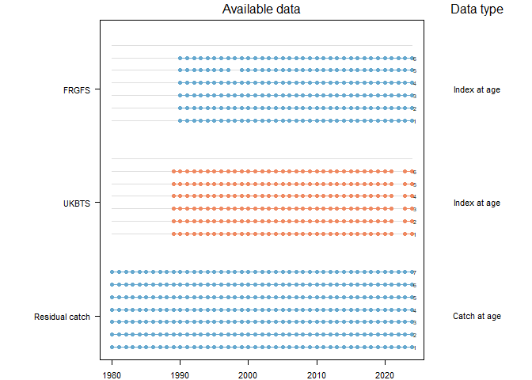<!-- -->

``` r
fit
```

    ## SAM model: log likelihood is -487.9112 Convergence OK

``` r
plot(fit)
```

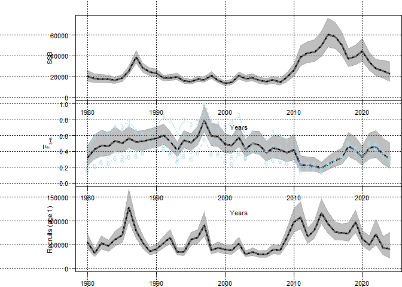<!-- -->

## OM basics

Follow decisions of last benchmark (2025) and reference points (WGNSSK
2025)

- Last benchmark: 2025

- Reference points: 2025 (presented/updated after benchmark at WGNSSK
  2025)

- Biological and fisheries selectivity data: resampled from last 5 years
  (2020-2024)

- Recruitment: Hockey-stick (segmented regression), using all years
  excluding the last assessment year (1980-2023, excluding 2024)

- Natural mortality: Age-dependent, time-invariant

- Maturity: Age-dependent, time-invariant

- Discard survival: ignored by WGNSSK/assessment, but studies from the
  English Channel for beam trawls and otter trawls suggest around 50%
  (50% surival used for ple.27.7e)

Some OM settings:

``` r
n <- 1000 ### number of iterations (simulation replicates)
n_years <- 100 ### number of projected years (can be reduced later)
               ### good to have more years initially for OM reference point estimation

### some year definitions
n_sample_yrs <- 5 ### resample biological data & selectivity from last X years
stf_nyrs <- 5 ### use last 5 years, e.g. for discard rate
yr_data <- 2024 ### last data year
int_yr_add <- TRUE ### add intermediate year (2025)
int_yr_catch <- 1151 ### catch advice from 2025 advice sheet
```

## FLStock object

``` r
### convert SAM fit into FLStock
stk <- SAM2FLStock(object = fit, stk = stk_data)
stk
```

    ## An object of class "FLStock"
    ## 
    ## Name:  
    ## Description: FLStock created from SAM model fit 
    ## Quant: age 
    ## Dims:  age   year    unit    season  area    iter
    ##  7   45  1   1   1   1   
    ## 
    ## Range:  min  max pgroup  minyear maxyear minfbar maxfbar 
    ##  1   7   7   1980    2024    3   6   
    ## 
    ## Metrics: 
    ##   rec: 29786 - 128445  (NA) 
    ##   ssb: 13394 - 60802  (NA) 
    ##   catch: 2088 - 11425  (NA) 
    ##   fbar: 0.18 - 0.79  (f)

``` r
stk_median <- stk ### save median for later

### some year dimensions
yrs_hist <- as.numeric(dimnames(stk)$year)
yrs_proj <- seq(from = dims(stk)$maxyear + 1, length.out = n_years)
n_years_new <- n_years

### add intermediate year (2025, extend stock later)
if (isTRUE(int_yr_add)) {
  n_years_new <- n_years + 1
  yrs_proj <- seq(from = dims(stk)$maxyear + 1, length.out = n_years_new)
  int_yr_yr <- min(yrs_proj)
}

yrs_mse <- sort(unique(c(yrs_hist, yrs_proj)))
```

## Add uncertainty to stock from SAM’s variance-covariance matrix

``` r
### add iteration dimension
stk <- FLCore::propagate(stk, n)
### add uncertainty estimated by SAM as iterations
set.seed(1)
uncertainty <- SAM_uncertainty(fit = fit, n = n) ### from FLfse
### add noise to stock
stock.n(stk)[] <- uncertainty$stock.n
stock(stk)[] <- computeStock(stk)
### add noise to F
harvest(stk)[] <- uncertainty$harvest
### add noise to catch numbers
catch.n(stk)[, ac(yrs_hist)] <- uncertainty$catch.n[, ac(yrs_hist)]
catch(stk) <- computeCatch(stk)
### update landings/discards
stk_tmp <- stk
landings.n(stk) <-  catch.n(stk_tmp) * 
  landings.n(stk_tmp)/(landings.n(stk_tmp) + discards.n(stk_tmp))
landings(stk) <- computeLandings(stk)
discards.n(stk) <-  catch.n(stk_tmp) * 
  discards.n(stk_tmp)/(landings.n(stk_tmp) + discards.n(stk_tmp))
discards(stk) <- computeDiscards(stk)

### show uncertainty
### each iteration corresponds to one possible self-consistent outcome from SAM
plot(stk) + theme_bw()
```

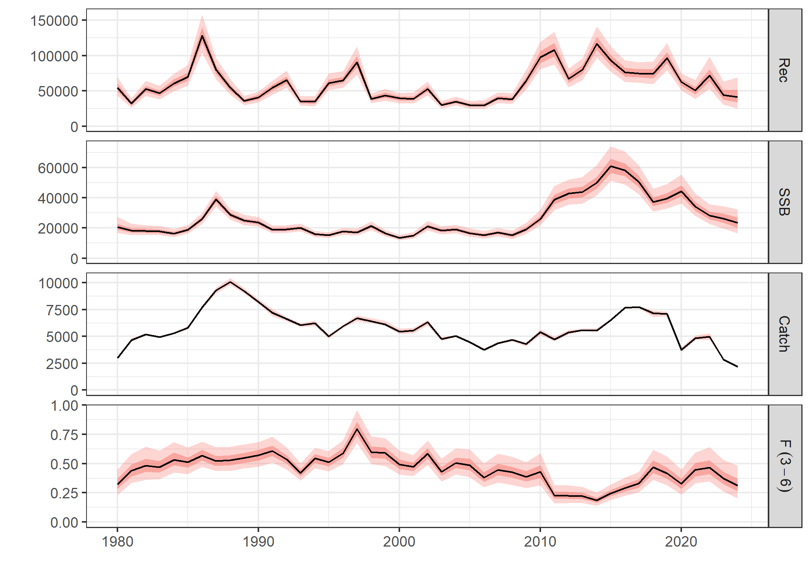<!-- -->

``` r
plot(stk, iter = 1:5) + theme_bw() ### with 1st 5 iterations
```

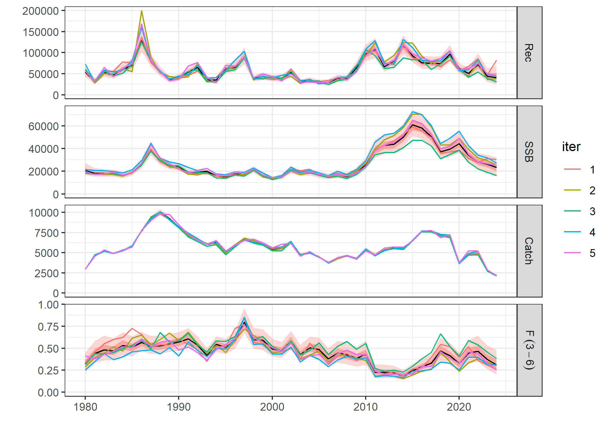<!-- -->

## Extend stock for MSE

``` r
stk_stf <- stf(stk, n_years_new, wts.nyears = stf_nyrs, 
               disc.nyears = stf_nyrs)
```

## Biological OM data (weights at age etc)

``` r
### Resample weights, maturity and natural mortality from the last X years 
### set up an array with one resampled year for each projection year 
### (including intermediate year) and replicate
### use the same resampled year for all biological parameters
set.seed(2)
### use last X data years to sample biological parameters
sample_yrs <- seq(to = yr_data, length.out = n_sample_yrs)
### get year position of sample years
sample_yrs_pos <- which(dimnames(stk_stf)$year %in% sample_yrs)

### create samples for biological data (weights, etc.)
### the historical biological parameters are identical for all iterations
### and consequently do not need to be treated individually
### (but keep age structure)
### create vector with resampled years
bio_samples <- sample(x = sample_yrs_pos, 
                      size = (n_years_new) * n, replace = TRUE)
### years to be populated
bio_yrs <- which(dimnames(stk_stf)$year %in% 
                   (yr_data + 1):dims(stk_stf)$maxyear)
### insert values
catch.wt(stk_stf)[, bio_yrs] <- c(catch.wt(stk)[, bio_samples,,,, 1])
stock.wt(stk_stf)[, bio_yrs] <- c(stock.wt(stk)[, bio_samples,,,, 1])
landings.wt(stk_stf)[, bio_yrs] <- c(landings.wt(stk)[, bio_samples,,,, 1])
discards.wt(stk_stf)[, bio_yrs] <- c(discards.wt(stk)[, bio_samples,,,, 1])
m(stk_stf)[, bio_yrs] <- c(m(stk)[, bio_samples,,,, 1])
mat(stk_stf)[, bio_yrs] <- c(mat(stk)[, bio_samples,,,, 1])

### show some example plot for catch weights
plot(catch.wt(stk_stf)) + ylim(c(0, NA)) + theme_bw()
```

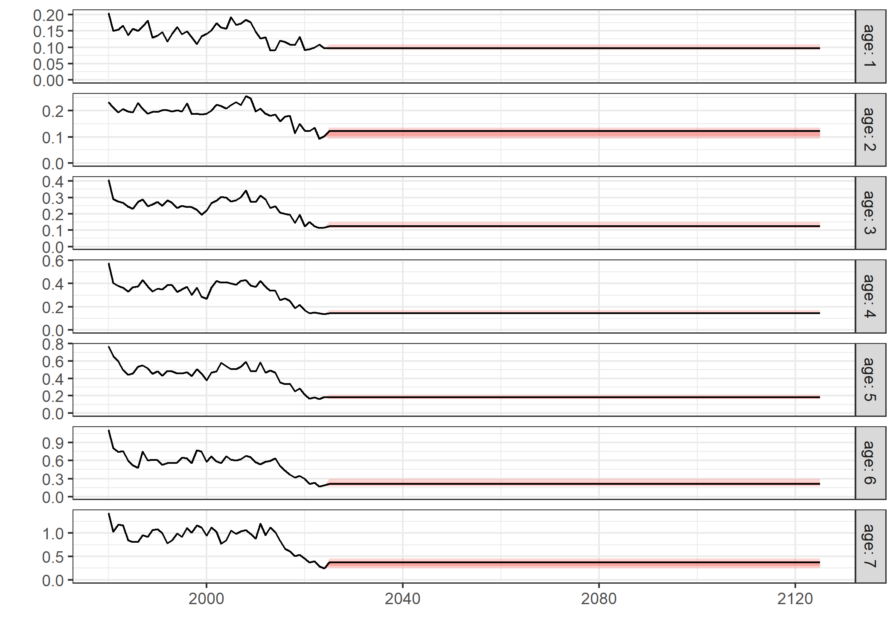<!-- -->

``` r
plot(iter(catch.wt(stk_stf), 1)) + ylim(c(0, NA)) + theme_bw() ### example iteration
```

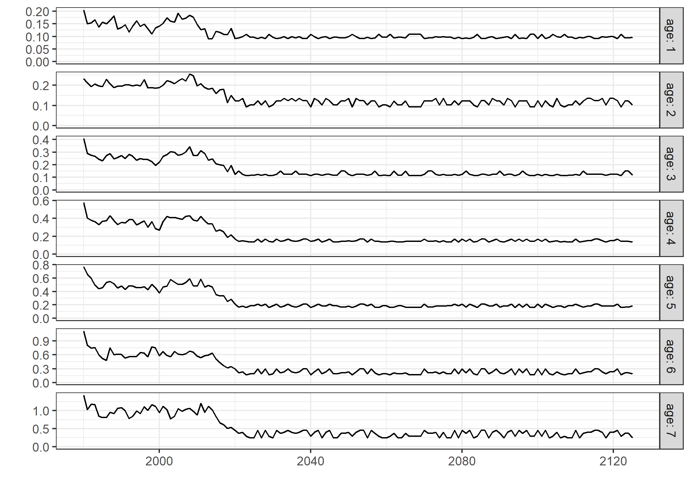<!-- -->

``` r
### do the same for selectivity
### use replicate specific selectivity and sample these
sel_samples <- sample(x = sample_yrs_pos, 
                      size = n_years_new * n, replace = TRUE)
### selectivity differs by replicate -> keep replicate specific values
sel_samples_iter <- split(sel_samples, 
                          f = rep(seq(n), each = n_years_new))
sel_vals <- as.numeric(sapply(seq(n), function(x) {
  c(harvest(stk)[, sel_samples_iter[[x]],,,, x])
}))
### insert
harvest(stk_stf)[, bio_yrs] <- sel_vals
```

## Stock-recruitment model

``` r
srplot(fit)
```

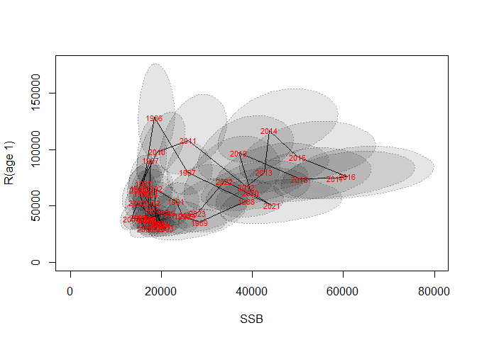<!-- -->

Approach:

- fit model to individual iterations

- generate recruitment residuals by sampling from historical residuals
  (smoothed with kernel density smoother to get wider range and
  non-discrete values)

Plaice 27.7d approach (for now, can be changed later)

- Use full year range because there is no obvious reduction in recent
  recruitment

- Hockey-stick (segmented regression) - not biologically plausible but
  ensure reduced productivity below breakpoint

- Fix breakpoint to Blim (ICES management reference point) - breakpoint
  is difficult/impossible to estimate because the SR pairs are just a
  cloud

- include auto-correlation (AR1) because residuals show significant
  auto-correlation

The code snippet below uses the older FLSR and not the newer FLSRTMB but
that could be changed if needed.

``` r
### create FLSR object
sr_model <- "segreg"
sr <- as.FLSR(stk_stf, model = sr_model)

### fix breakpoint
sr_fixed = list(b = 25110) ## list()

### 1st: fit model to median estimates from SAM
sr_med <- as.FLSR(stk_median, model = sr_model)
sr_med <- fmle(sr_med, method = 'L-BFGS-B', fixed = sr_fixed,
               control = list(trace = 0))
plot(sr_med) + theme_bw()
```

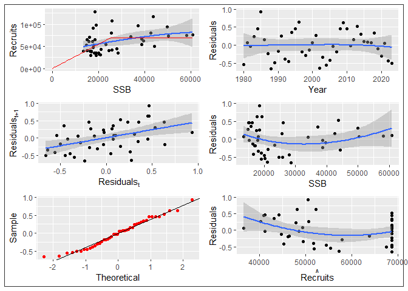<!-- -->

``` r
### fit model to all iterations
### run in parallel to speed up processing
cl_tmp <- makeCluster(10) ### 10 parallel workers
registerDoParallel(cl_tmp)
sr <- fmle_parallel(sr, cl_tmp, method = 'L-BFGS-B', fixed = sr_fixed)
stopCluster(cl_tmp)
### or run sequentially (slower)
### sr <- fmle(sr, cl_tmp, method = 'L-BFGS-B', fixed = sr_fixed)

### sometimes fmle fails in first attempt for some iterations
### run again for failed iterations - if needed
pos_error <- which(is.na(params(sr)[1]))
if (isTRUE(length(pos_error) > 0)) {
  sr_corrected <- FLCore::iter(sr, pos_error)
  sr_corrected <- fmle(sr_corrected, method = 'L-BFGS-B', fixed = sr_fixed,
                       control = list(trace = 0))
  sr[,,,,, pos_error] <- sr_corrected[]
  params(sr)[, pos_error] <- params(sr_corrected)
}

### check autocorrelation of residuals
### for simplicity, use SAM median 
sr_acf <- acf(residuals(sr_med), plot = FALSE, na.action = na.exclude)
plot(sr_acf)
```

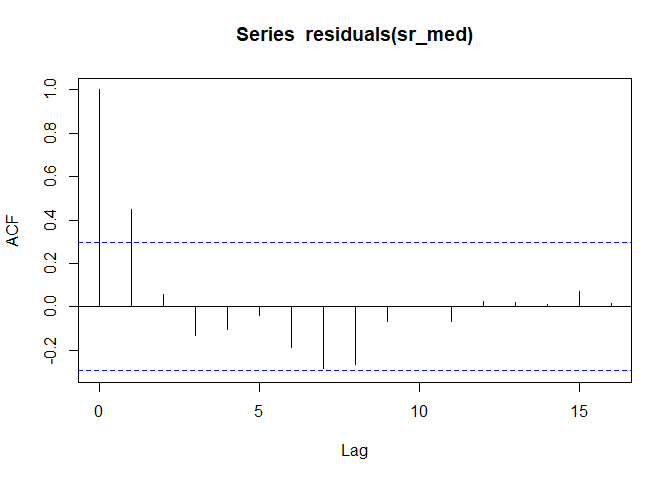<!-- -->

``` r
sr_rho <- sr_acf$acf[2]
sr_rho
```

    ## [1] 0.4475743

``` r
### only include if lag-1 auto-correlation is above threshold
ci <- qnorm((1 + 0.95)/2)/sqrt(sr_acf$n.used)
include_ar <- ifelse(sr_rho >= ci, TRUE, FALSE)
include_ar
```

    ## [1] TRUE

Now, lets generate the recruitment residuals for the MSE projection

``` r
### generate residuals for MSE
### years with missing residuals
yrs_res <- colnames(rec(sr))[which(is.na(iterMeans(rec(sr))))]
### go through iterations and create residuals
### use kernel density to create smooth distribution of residuals
### and sample from this distribution
res_new <- foreach(iter_i = seq(dim(sr)[6])) %do% {
  set.seed(iter_i)
  ### get residuals for current iteration
  res_i <- c(FLCore::iter(residuals(sr), iter_i))
  res_i <- res_i[!is.na(res_i)]
  ### calculate kernel density of residuals
  density <- density(x = res_i)
  ### sample residuals
  mu <- sample(x = res_i, size = length(yrs_res), replace = TRUE)
  ### "smooth", i.e. sample from density distribution
  res_new <- rnorm(n = length(yrs_res), mean = mu, sd = density$bw)
  ### "add" autocorrelation
  if (isTRUE(include_ar)) {
    ### use iteration-specific auto-correlation
    sr_acf_i <- acf(res_i, lag.max = 1, plot = FALSE, na.action = na.exclude)
    sr_rho_i <- sr_acf_i$acf[2]
    res_ac <- rep(0, length(yrs_res))
    res_ac[1] <- sr_rho * tail(res_i, 1) + sqrt(1 - sr_rho^2) * res_new[1]
    for (r in 2:length(res_ac)) {
      res_ac[r] <- sr_rho * res_ac[r - 1] + sqrt(1 - sr_rho^2) * res_new[r]
    }
    res_new <- res_ac
  }
  return(res_new)
}
### insert into model
residuals(sr)[, yrs_res] <- unlist(res_new)
### exponentiate residuals to get factor
residuals(sr) <- exp(residuals(sr))
sr_res <- residuals(sr)

### plot residuals
plot(sr_res) + ylim(c(0, NA)) + theme_bw()
```

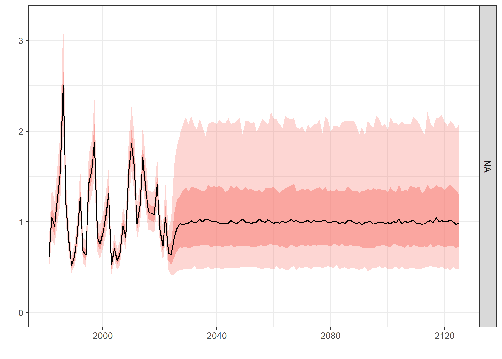<!-- -->

``` r
plot(sr_res, iter = 1:5) + ylim(c(0, NA)) + theme_bw() ### show 1st 5 iterations
```

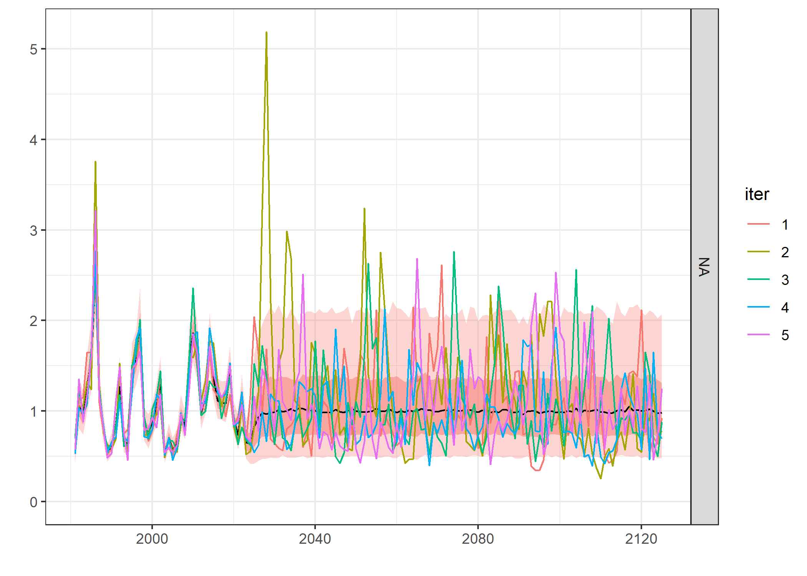<!-- -->

## Survival process error

The SAM model includes a survival process error, i.e. reducing the stock
numbers in a given year for a given age by natural and fishing mortality
does not exactly match the numbers for the next age in the following
year. This should be included in the MSE and can be include by adding
“residuals” to the numbers at age.

``` r
### survival process error estimated by SAM
uncertainty$proc_error
```

    ## An object of class "FLQuant"
    ## iters:  1000 
    ## 
    ## , , unit = unique, season = all, area = unique
    ## 
    ##    year
    ## age all             
    ##   1 0.380474(0.0484)
    ##   2 0.053773(0.0386)
    ##   3 0.053773(0.0386)
    ##   4 0.053773(0.0386)
    ##   5 0.053773(0.0386)
    ##   6 0.053773(0.0386)
    ##   7 0.053773(0.0386)
    ## 
    ## units:  NA

``` r
### the values in the first age class will be overwritten by the recruitment model residuals

### create noise for process error
set.seed(3)
proc_res <- stock.n(stk_stf) %=% 0 ### template FLQuant
proc_res[] <- stats::rnorm(n = length(proc_res), mean = 0, 
                           sd = uncertainty$proc_error)
### the proc_res values follow a normal distribution,
### exponentiate to get log-normal residuals
proc_res <- exp(proc_res)
### proc_res is a factor by which the numbers at age are multiplied
### for historical period, numbers already include process error from SAM
### -> remove deviation
proc_res[, dimnames(proc_res)$year <= yr_data] <- 1
### remove deviation for first age class (recruits)
proc_res[1, ] <- 1

### plot
plot(proc_res) + ylim(c(0, NA)) + theme_bw()
```

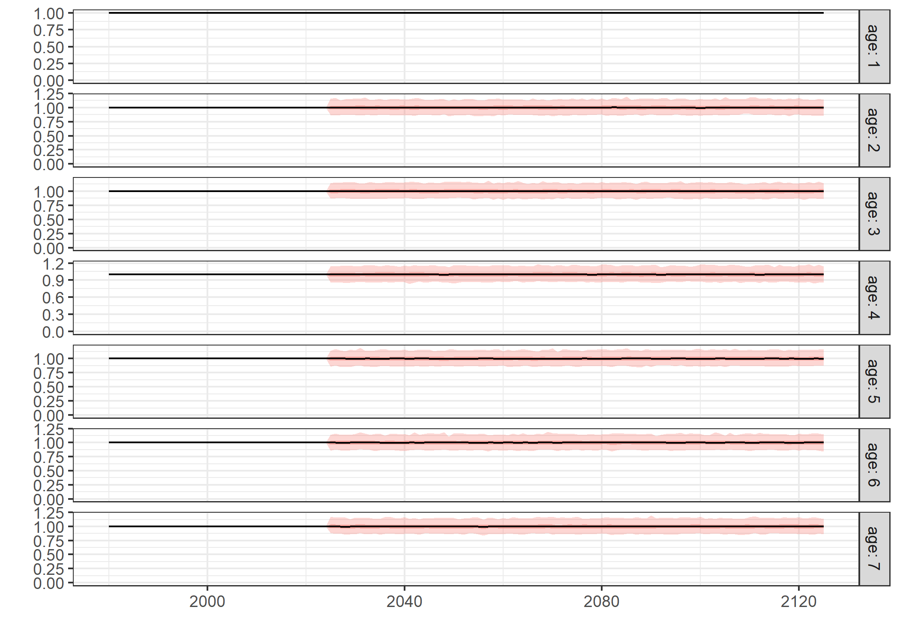<!-- -->

``` r
plot(iter(proc_res, 1)) + ylim(c(0, NA)) + theme_bw()
```

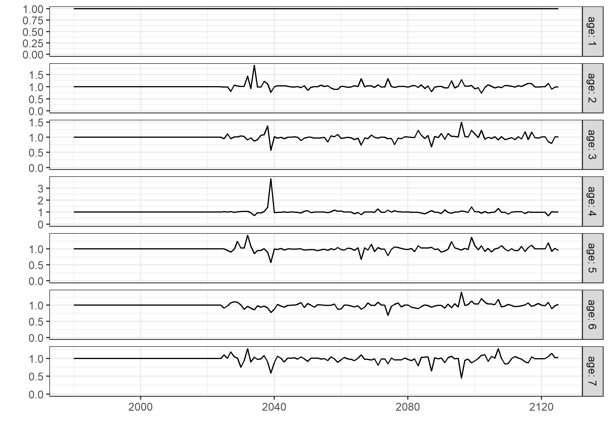<!-- -->

## Intermediate year

The data and stock assessment go up to 2024. It is probably a good idea
to include an intermediate year, to project the stock to 2025, so that
2026 can be the first year in the MSE projection.

``` r
if (isTRUE(int_yr_add)) {
  ctrl_int <- fwdControl(data.frame(year = int_yr_yr, 
                                    quant = "catch", 
                                    value = int_yr_catch))
  ### project forward for intermediate year
  stk_int <- fwd(stk_stf, control = ctrl_int, sr = sr, 
                 deviances = residuals(sr))
  
  ### add process noise
  stock.n(stk_int) <- stock.n(stk_int) * proc_res
  stock(stk_int)[] <- computeStock(stk_int)
  
  stk_fwd <- stk_int
  
} else {
  
  stk_fwd <- stk_stf
  
}
```

## Biological observations

The management procedure (MP) should not receive data directly from the
OM. This includes biological data (stock and catch weights, etc).
Passing them directly to the MP is cheating. In the OM, these data were
resampled from historical values. In the MP, a simple approach is to use
averages from the sampled period.

``` r
### base on OM stock
stk_oem <- stk_fwd

### projection years
proj_yrs <- (yr_data + 1):range(stk_oem)[["maxyear"]]

### use means of sampled values for projection period
stock.wt(stk_oem)[, ac(proj_yrs)] <- 
  yearMeans(stock.wt(stk_oem)[, ac(sample_yrs)])
m(stk_oem)[, ac(proj_yrs)] <- yearMeans(m(stk_oem)[, ac(sample_yrs)])
mat(stk_oem)[, ac(proj_yrs)] <- yearMeans(mat(stk_oem)[, ac(sample_yrs)])
### remove stock assessment results
stock.n(stk_oem)[] <- stock(stk_oem)[] <- harvest(stk_oem)[] <- NA

### catch weights for projection years
catch.wt(stk_oem)[, ac(proj_yrs)] <- 
  yearMeans(catch.wt(stk_oem)[, ac(sample_yrs)])
landings.wt(stk_oem)[, ac(proj_yrs)] <- 
  yearMeans(landings.wt(stk_oem)[, ac(sample_yrs)])
discards.wt(stk_oem)[, ac(proj_yrs)] <- 
  yearMeans(discards.wt(stk_oem)[, ac(sample_yrs)])
```

Catch data are probably not needed in a shortcut… But lets create
residuals anyway for checking with full MSE later.

``` r
### create noise for catch
set.seed(5)
catch_res <- catch.n(stk_fwd) %=% 0 ### template FLQuant
catch_res[] <- stats::rnorm(n = length(catch_res), mean = 0, 
                            sd = uncertainty$catch_sd)
### the catch_res values are on a normal scale,
### exponentiate to get log-normal 
catch_res <- exp(catch_res)
### catch_res is a factor by which the numbers at age are multiplied
### for historical period, pass on real observed catch
### -> remove deviation
### -> includes difference between OM and MP discard survival
catch_res[, ac(yrs_hist)] <- 
  window(catch.n(stk_oem), end = yr_data) / 
  window(catch.n(stk_fwd), end = yr_data)
```

## Indices

Not needed in a shortcut…

## Shortcut assessment error

The residuals in a “shortcut MSE” should not just be random but follow
the behaviour of the assessment model (magnitude of assessment error,
bias, and auto-correlation). A simplistic way to get this is with a
retrospective analysis:

### SAM retro

``` r
### run 10-year retro
retro <- retro(fit = fit, year = 10, ncores = 10)

opar <- par()
par(mar = c(2, 4.5, 0.5, 0.5))
plot(retro)
```

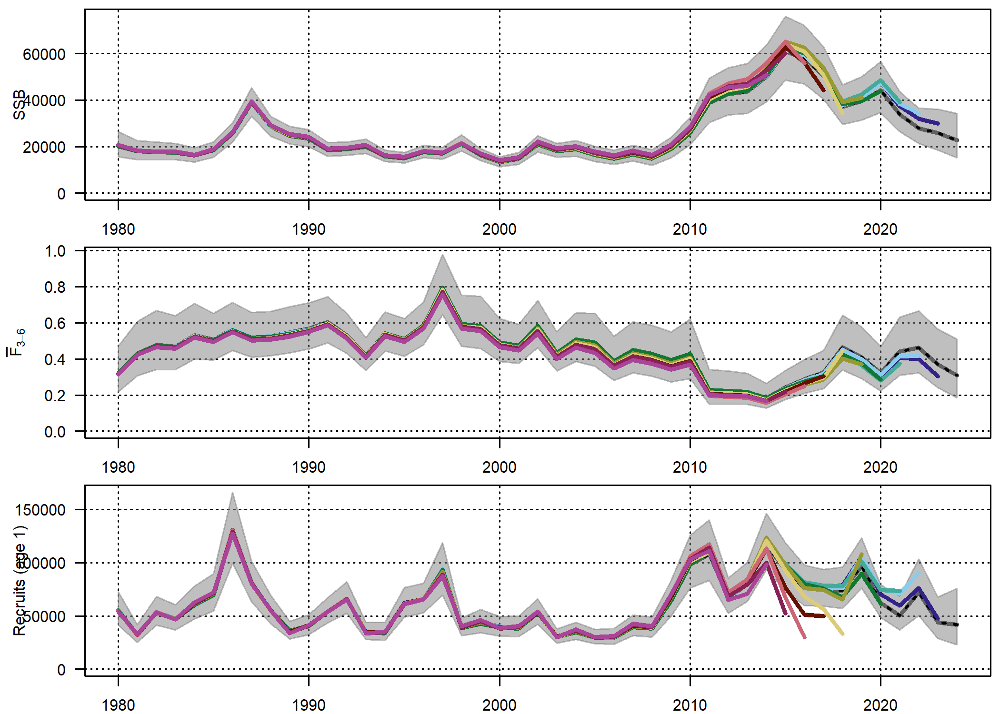<!-- -->

``` r
par(opar)
```

    ## Warning in par(opar): graphical parameter "cin" cannot be set

    ## Warning in par(opar): graphical parameter "cra" cannot be set

    ## Warning in par(opar): graphical parameter "csi" cannot be set

    ## Warning in par(opar): graphical parameter "cxy" cannot be set

    ## Warning in par(opar): graphical parameter "din" cannot be set

    ## Warning in par(opar): graphical parameter "page" cannot be set

``` r
### get SSB values from all retro runs
ssb_table <- function(x) {
  tmp <- data.frame(SSB = ssbtable(x)[, "Estimate"])
  tmp$year <- as.numeric(rownames(tmp))
  rownames(tmp) <- NULL
  tmp$assessment <- max(tmp$year)
  return(tmp)
}
retro_SSB <- lapply(retro, ssb_table)
retro_SSB <- do.call(rbind, retro_SSB)

### plot SSB retro
df <- rbind(retro_SSB, ssb_table(fit))
df %>% filter(assessment < 2023) %>%
  ggplot(aes(x = year, y = SSB/1000, colour = as.factor(assessment))) +
  geom_line(data = df %>% filter(assessment == 2023),
            colour = "black") +
  geom_line(show.legend = FALSE, linewidth = 0.2) +
  theme_bw(base_size = 8) +
  coord_cartesian(ylim = c(0, NA)) +
  labs(x = "Year", y = "SSB (1000 t)")
```

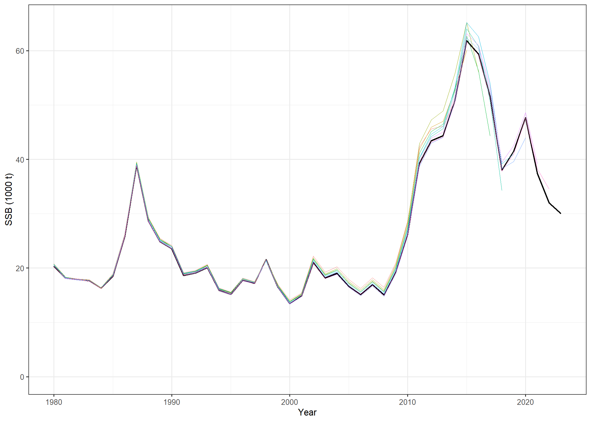<!-- -->

``` r
### SSB error
SSB_error <- retro_SSB %>%
  filter(year == assessment) %>%
  mutate(SSB_retro = SSB, 
         SSB = NULL, 
         assessment = NULL) %>%
  left_join(ssb_table(fit) %>% 
              mutate(assessment = NULL)) %>%
  mutate(SSB_ratio = SSB_retro/SSB)
```

    ## Joining with `by = join_by(year)`

``` r
mean(SSB_error$SSB_ratio)
```

    ## [1] 1.03498

``` r
median(SSB_error$SSB_ratio)
```

    ## [1] 1.004194

``` r
sd(SSB_error$SSB_ratio)
```

    ## [1] 0.1140321

``` r
### plot
trans_from <- function(from = 1) {
  trans <- function(x) x - from
  inv <- function(x) x + from
  scales::trans_new("from", trans, inv, 
            domain = c(from, Inf))
}
SSB_error %>%
  select(year, SSB_ratio) %>%
  ggplot(aes(x = year, y = SSB_ratio)) +
  geom_col(fill = "darkgrey", colour = "darkgrey") +
  theme_bw(base_size = 8) +
  labs(x = "Year", y = "Terminal SSB / SSB") +
  geom_hline(yintercept = 1) +
  scale_y_continuous(trans = trans_from(),
                     limits = c(NA, NA), breaks = c(0.9, 1, 1.1, 1.2)) +
  scale_x_continuous(breaks = seq(2014, 2022, 2))
```

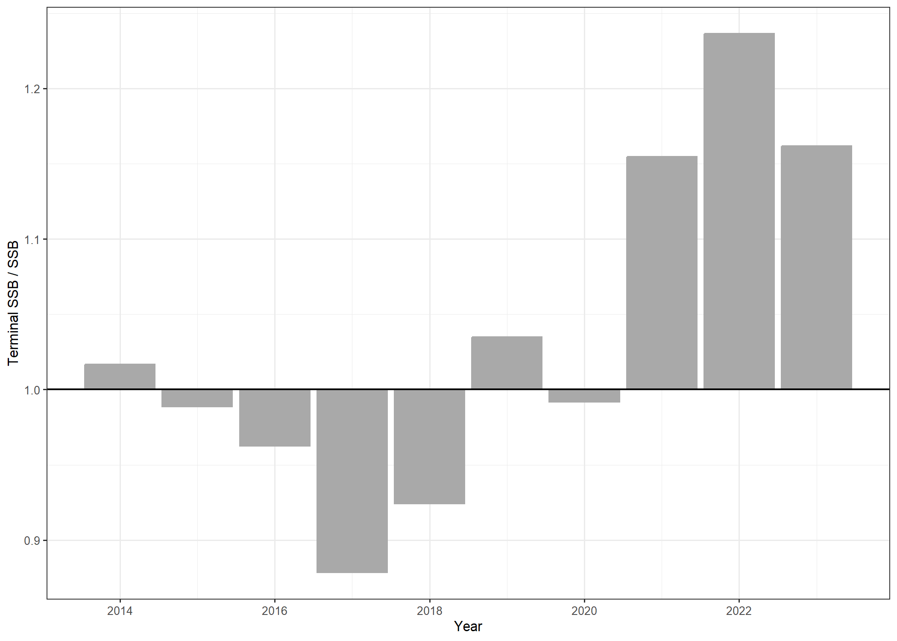<!-- -->

``` r
### auto-correlation
SSB_err_acf <- acf(SSB_error$SSB_ratio, plot = FALSE)
plot(SSB_err_acf)
```

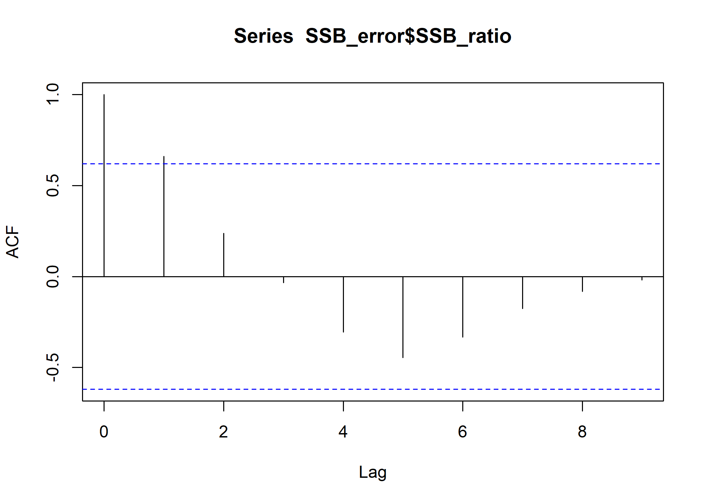<!-- -->

``` r
c(SSB_err_acf$acf)[2]
```

    ## [1] 0.6596292

### Kernel density smoother for retro residuals

Use same approach as for recruitment residuals: Fit kernel density
smoother to residuals, and sample from this to generate residuals for
projection. This keeps the magnitude, bias, and auto-correlation.

``` r
### templates for storing residuals
ssb_res <- ssb(stk_fwd) %=% NA_real_
ssb_res_ar <- ssb(stk_fwd) %=% NA_real_
n_res <- length(dimnames(ssb_res)$year)

### auto-correlation
rho <- acf(SSB_error$SSB_ratio, lag.max = 1)$acf[2]
```

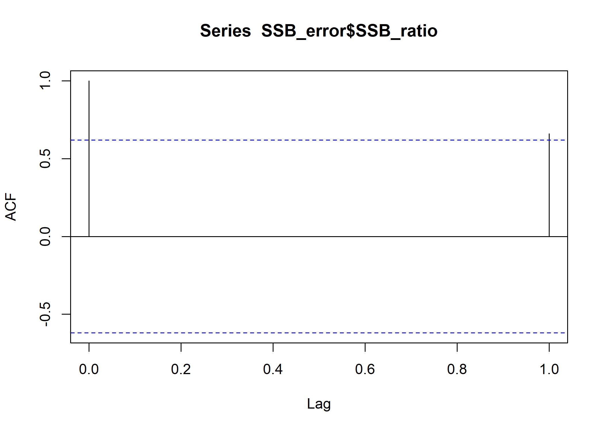<!-- -->

``` r
### extract residuals
res <- SSB_error$SSB_ratio ### use log scale
### calculate kernel density of residuals
density <- density(x = res, bw = 0.05)

### create residuals - 1st: without auto-correlation
res_SSB <- foreach (iter_i = seq(dim(stk_fwd)[6])) %do% {
  set.seed(iter_i)
  ### sample residuals
  mu <- sample(x = res, size = n_res, replace = TRUE)
  ### "smooth", i.e. sample from density distribution
  res_new <- rnorm(n = n_res, mean = mu, sd = density$bw)
  
  return(res_new)
}

### 2nd: add auto-correlation
### create residuals - 1st: without auto-correlation
res_SSB_ar <- foreach (res_i = res_SSB) %do% {
  res_i_ar <- res_i
  ### "add" autocorrelation
  for (r in 2:n_res) {
    res_i_ar[r] <- exp(rho * log(res_i_ar[r - 1]) + sqrt(1 - rho^2) * log(res_i[r]))
  }
  return(res_i_ar)
}

ssb_res[] <- unlist(res_SSB)
ssb_res_ar[] <- unlist(res_SSB_ar)

### plot
plot(FLQuants(without_AR = ssb_res,
              with_AR = ssb_res_ar)) + theme_bw()
```

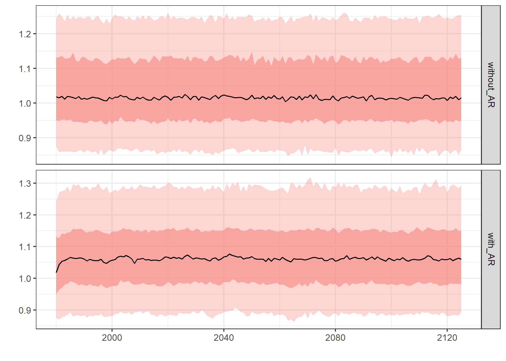<!-- -->

``` r
mean(ssb_res)
```

    ## [1] 1.035448

``` r
mean(ssb_res_ar)
```

    ## [1] 1.07061

``` r
median(ssb_res)
```

    ## [1] 1.014943

``` r
median(ssb_res_ar)
```

    ## [1] 1.060877

WARNING: This needs some more work… The residuals with auto-correlation
are slightly too high…

## Objects

The R (FLR) objects from this markdown can then be used in the “shortcut
MSE”.

``` r
om <- FLom(stock = stk_fwd, 
           sr = sr)
```
